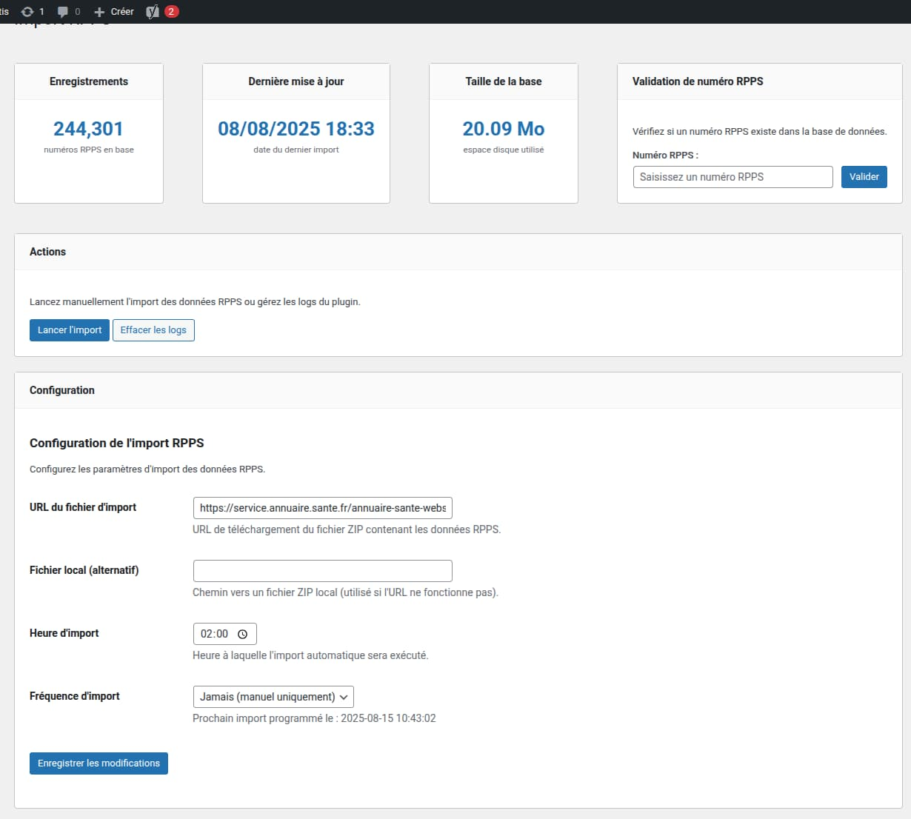

# Plugin Wordpress "Import RPPS"

- Nom du plugin : **Import RPPS**
- Développé par : [Answeb](https://www.answeb.net)
- Version : 1.0.0
- Requis : WordPress 6.8.1 ou supérieur, PHP8 ou supérieur

## Description

Ce plugin Wordpress permet de maintenir à jour une liste de numéros RPPS (Répertoire Partagé des Professionnels de
Santé). Il permet au module d'inscription de valider le numéro RPPS saisi par l'utilisateur lors de son inscription.

## Installation

### Installation manuelle (développement)

1. Télécharger ou cloner le plugin dans `/wp-content/plugins/`
2. Exécuter `composer install` dans le répertoire du plugin
3. Se connecter à l'administration WordPress
4. Aller dans **Extensions > Extensions installées**
5. Localiser "Import RPPS" et cliquer sur **Activer**
6. Accéder aux réglages via **Outils > Import RPPS**

### Installation via fichier ZIP

1. Télécharger le fichier `.zip` depuis les releases GitHub
2. Se connecter à l'administration WordPress
3. Aller dans **Extensions > Ajouter une extension**
4. Cliquer sur **Téléverser une extension**
5. Sélectionner le fichier `.zip` et cliquer sur **Installer maintenant**
6. Cliquer sur **Activer l'extension**
7. Accéder aux réglages via **Outils > Import RPPS**

### Installation via le répertoire WordPress (si publié)

1. Se connecter à l'administration WordPress
2. Aller dans **Extensions > Ajouter une extension**
3. Rechercher "Import RPPS"
4. Cliquer sur **Installer maintenant** puis **Activer**
5. Accéder aux réglages via **Outils > Import RPPS**

### Configuration du plugin

Le plugin est configurable via l'interface d'administration de WordPress. Il permet de définir les paramètres suivants :

- **URL du fichier d'import** : URL du fichier contenant la liste des numéros RPPS à importer. Par défaut, il s'agit de
  `https://service.annuaire.sante.fr/annuaire-sante-webservices/V300/services/extraction/PS_LibreAcces`. ce fichier sera
  sauvegardé sour le chemin complet ci-dessous.
- **Nom du fichier d'import** : Chemin complet vers fichier d'importation contenant la liste des numéros RPPS à
  importer.
- **Fréquence d'import** : Intervalle de temps entre les import automatiques (hebdomadaire ou mensuel) ainsi que
  l'heure de l'import.

### Fonctionnalités

Le plugin s'enregistre dans WordPress et ajoute une page de configuration dans le menu d'administration
La page permet de configurer le plugin, et également de lancer manuellement l'export des données.
Une zone de journalisation affiche les messages d'erreur lors de l'export (et le nombre de numéros RPPS en base).

### Importation des données

Le plugin télécharge le fichier contenant la liste des numéros RPPS, le décompresse et l'importe dans la base de données.
Cette étape est longue car le fichier fait plusieurs centaines de méga-octets !

## Utilisation de la fonction de validation

Le plugin fournit une fonction globale `import_rpps_validate_number()` qui peut être utilisée depuis n'importe quel thème WordPress ou plugin pour valider un numéro RPPS.

### Exemples d'utilisation

#### Dans un thème WordPress

```php
// Exemple dans functions.php ou dans un fichier de template
$numero_rpps = '12345678901';

if (function_exists('import_rpps_validate_number')) {
    $est_valide = import_rpps_validate_number($numero_rpps);
    
    if ($est_valide) {
        echo 'Le numéro RPPS est valide';
    } else {
        echo 'Le numéro RPPS n\'est pas valide';
    }
} else {
    echo 'Le plugin Import RPPS n\'est pas activé';
}
```

## Screenshot



## Crédits

### Answeb - Développement du plugin

Ce plugin a été développé par [Answeb](https://www.answeb.net), agence spécialisée dans le développement web et les
solutions e-commerce. Answeb accompagne les entreprises dans leur transformation digitale en créant des solutions
sur-mesure adaptées à leurs besoins spécifiques.

**Expertise Answeb :**

- Développement WordPress & WooCommerce, Prestashop
- Intégrations ERP et solutions métier
- Connecteurs et API personnalisés
- Solutions e-commerce avancées

Pour toute question technique ou demande d'évolution du plugin, vous pouvez contacter l'équipe Answeb via notre
site web.

## Contribution
Les contributions sont les bienvenues ! Si vous souhaitez contribuer à ce projet, faites une pull request sur la branche develop. Vous devriez également ouvrir une issue pour documenter votre contribution.
